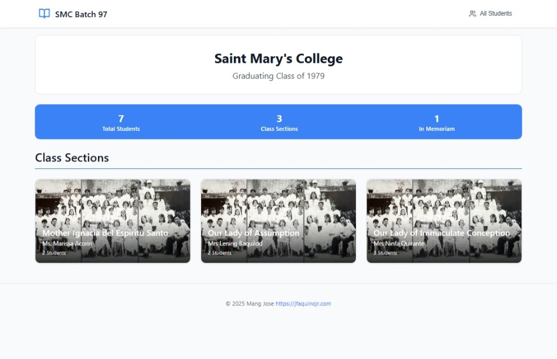
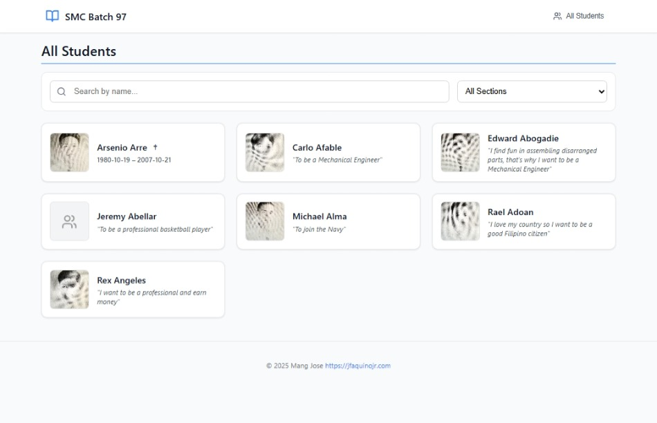
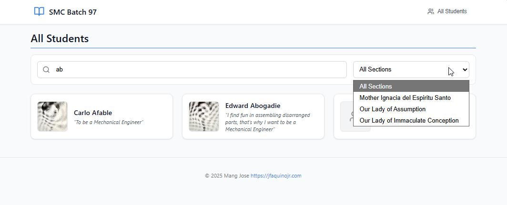

# Digital Yearbook

A simple, single-file yearbook website. No build process, no dependencies, no complexity.



## What It Does

Displays your yearbook data in a clean, browsable format:
- Browse students by class section
- Search and filter students
- View individual student profiles
- Memorial tributes for departed classmates

### Screenshots

**Homepage with Class Sections**


**Browse All Students**



**Student Profile**


**Search & Filter**



## How To Use

1. Open `index.html` in any modern browser
2. Upload your `yearbook-data.json` file when prompted
3. Make sure your `images/` folder is in the same directory

That's it.

## File Structure

```
index.html              # The entire website (HTML + React + styles)
yearbook-data.json      # Your student and class data
images/
  ├── fullsize/         # Full-size student photos
  ├── thumbnails/       # Thumbnail photos
  └── sections/         # Class section photos
```

## Data Format

The website expects a JSON file with three main sections:

```json
{
  "school": {
    "name": "Your School Name",
    "year": "1997",
    "graduationYear": "Batch 97"
  },
  "classSections": [...],
  "students": [...]
}
```

See `yearbook-data.json` for the complete structure.

## Features

- **No installation required** - Just open the HTML file
- **Works offline** - Everything runs in the browser
- **Mobile friendly** - Responsive design
- **Search & filter** - Find students quickly
- **Memorial support** - Honor departed classmates with † symbol

## Tech Stack

- React 18 (via CDN)
- Vanilla CSS (inline styles)
- Pure JavaScript

No npm. No webpack. No build step.

## Browser Support

Works in any modern browser that supports ES6 and React 18.

---

Made with simplicity in mind. [jfaquinojr.com](https://jfaquinojr.com)
